<!--
Profile README for: https://github.com/Kamil-Krawiec
-->

<h1 align="center">Hi, I'm Kamil 👋</h1>

  I build projects around <b>data engineering</b>, <b>automation</b> and <b>AI</b> — from quick prototypes to reproducible tools.
   
  Based in Wrocław, Poland.

  <a href="https://kodzero.dev/">Website</a> •
  <a href="https://github.com/Kamil-Krawiec">GitHub</a> •
  <a href="https://www.linkedin.com/in/kamil-krawiec-wroclaw/">LinkedIn</a> •
  <a href="mailto:kodzeroyt@gmail.com">kodzeroyt@gmail.com</a>

  
  
  
  
  

---

## 🚀 What I’m into
- **Data pipelines & automation** (Docker-first, reproducible setups)
- **Applied ML / optimization** (heuristics, multi-objective, experimentation)
- **Developer-friendly tools** (simple APIs, good docs, CI)

---

## ⭐ Featured projects

### 🔊 Piper OpenAI TTS HTTP Server
**FastAPI service** that wraps Piper into an **OpenAI-compatible** `/v1/audio/speech` endpoint (local or Docker), with **on-demand voice downloads + caching**.  
👉 Repo: https://github.com/Kamil-Krawiec/piper-tts-http-server

---

### 🎓 Master’s thesis — Intelligent Data Generator (Data-filler)
A tool to generate **synthetic data** tailored to database schemas (packaged + documented).  
👉 Repo: https://github.com/Kamil-Krawiec/Data-filler  
📦 PyPI: `intelligent-data-generator`

---

### 🧠 MS-RCPSP (Multi-Skill Resource-Constrained Project Scheduling)
Optimization approach for **MS-RCPSP** using **Ant Colony Optimization (ACO)** and **NSGA-II** (multi-objective: cost vs duration).  
👉 Repo: https://github.com/Kamil-Krawiec/MS-RCPSP

---

## 🧰 Toolbox
**Languages:** Python, SQL, C++, Java  
**Data/ML:** pandas, NumPy, scikit-learn, Jupyter  
**Backend:** FastAPI, REST APIs  
**Ops:** Docker, GitHub Actions  
**Databases:** SQL / PL/SQL

---

## 📈 GitHub stats

  
  

  

  

  

---

## 🤝 Let’s connect
If you want to collaborate (data tools, automation, ML experiments) — ping me:
- 🌐 https://kodzero.dev/
- 💼 https://www.linkedin.com/in/kamil-krawiec-wroclaw/
- ✉️ kodzeroyt@gmail.com
